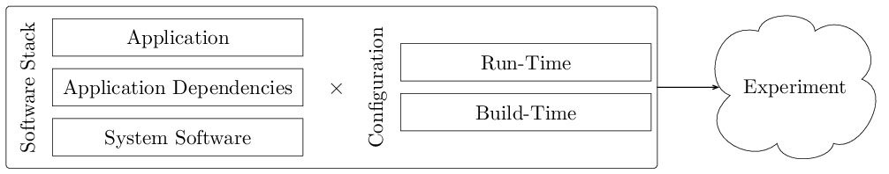

.. Copyright (c) 2019-2021, Triad National Security, LLC
                            All rights reserved.

Introduction
============
Computer system benchmarking provides a means to compare or assess the
performance of hardware or software against a point of reference. Because of
some of the reasons discussed here, achieving experimental reproducibility in
this domain is challenging. To aid in this, we are developing an extensible
software framework named *bueno* that helps support what we call
*well-provenanced computer system benchmarking*, or *well-provenanced
benchmarking* for short. In this context, a well-provenanced benchmark maintains
to the extent possible the minimal required set of data needed to share,
replicate, and revisit a prior result up to a given standard. To that end, the
bueno project aims to provide convenient access to mechanisms that aid in the
automated capturing of relevant *eatures* that define a sufficiently precise
experiment. The following provides additional motivation, followed by a summary
of bueno’s current software architecture, feature set, usage, and methodology
toward this goal.

Motivation
----------
Experimental reproducibility is a crucial component of the scientific process.
Capturing the relevant features that define a sufficiently precise experiment is
a difficult task. This difficulty is mostly due to the diversity and non-trivial
interplay among computer platforms, system software, and programs of interest.
To illustrate this claim, consider the interconnected relationships formed among
the components shown in the figure below. Here, we define an experiment as the
Cartesian product of a given software stack and its configuration. The elements
shown in the figure below are described as follows:

* **System Software**: the OS, compilers, middleware, runtimes, and services
  used by an application or its software dependencies.  Examples include Linux,
  the GCC, MPI libraries, and OpenMP.

* **Application Dependencies**: the software used by the application driver
  program, including linked software libraries and stand-alone executables.
  Examples include mathematical libraries, data analysis tools, and their
  respective software dependencies.

* **Application**: the driver program used to conduct a computer system
  benchmark, including sequential and parallel programs with and without
  external software dependencies. Examples include micro-benchmarks, proxy
  applications, and full applications.

* **Build-Time Configuration**: the collection of parameters used to build an
  application and its dependencies. This includes preprocessor, compile, and
  link directives that have an appreciable effect on the generated object files
  and resulting executables. Examples include whole program optimization (WPO)
  and link-time optimization (LTO) levels, which may vary across components in
  the software stack.

* **Run-Time Configuration**: the collection of parameters used at run-time that
  have an appreciable effect on the behavior of any software component used
  during a computer system benchmark.  Examples include application inputs and
  environmental controls.

In summary, contemporary computing environments are complex. Experiments may
have complicated software dependencies with non-trivial interactions, so
capturing relevant experimental characteristics is burdensome without
automation.

Software Overview
-----------------
In this section, we begin with an overview of bueno's core software
architecture. We then provide a brief introduction to container technology and
motivate its use in bueno. Finally, we summarize bueno's command-line interface
(CLI) and module services.

Core Framework
--------------
`bueno <https://github.com/lanl/bueno>`_ is an open-source (BSD-3) software
framework written in type-annotated Python 3. Its internal software architecture
is straightforward and organized into three major components: ``core``,
``public``, and ``service``. The ``core`` component implements the
infrastructure used internally within bueno.  The `public` component, detailed
in :ref:`Module Services`, implements a collection of Python modules made
available to Python programs executed under bueno's supervision. We call these
programs *bueno run scripts*, and they are the programmable interface that
drives the bueno framework.  Finally, the ``service`` component, detailed in
:ref:`Command Line Interface Services`, implements the infrastructure made
accessible through a CLI that carries out a specific task, for example,
executing a run script.

Use of Container Technology
---------------------------
Container technology has garnered attention recently, especially in cloud and
HPC environments. This attention is well-deserved, as this approach has
demonstrated broad utility in software development and deployment tasks. In the
context of container-enabled experimental reproducibility, we note the following
properties that serve our work's ultimate goal:

* **Data Encapsulation**: Containers offer nearly complete encapsulation of a
  given software stack. This capability allows researchers the ability to
  revisit a prior experimental configuration. An example is conducting a
  post-mortem analysis of saved binary files to understand better the
  performance characteristics of a previous benchmarking result.

* **Low-Overhead Execution**: The use of a containerized software stack
  introduces little to no appreciable overhead compared to its non-containerized
  analog.

* **Separation of Concerns**: Container images can be built, shared, and later
  augmented to create a new *base image*, which in turn can be shared and
  augmented further.  This process allows for a separation of concerns among a
  potentially large conglomerate of multidisciplinary expertise.

In summary, container technology is a promising avenue for capturing relevant
features that define a sufficiently precise experiment. For this reason, bueno
implements features that make use of containers to improve the likelihood of
experimental reproducibility. Currently, bueno supports unprivileged container
activation through `Charliecloud <https://github.com/hpc/charliecloud>`_.

Command Line Interface Services
-------------------------------
CLI services are currently made available through bueno's ``run`` command.  The
``run`` service coordinates container image activation and the execution of
bueno run scripts, a programmatic description of the steps required to conduct a
computer system benchmarking experiment. Currently, there are two image
activators implemented in bueno: ``charliecloud`` and ``none``.  The former uses
Charliecloud to activate a given container image. The latter is a pass-through
to the host, which offers a lower degree of reproducibility when compared to the
former.

Module Services
---------------
Because of the diversity among computer platforms, system software, and programs
of interest, program execution and subsequent analysis of their generated
outputs are expressed through Python programs executed by bueno’s ``run``
service.  A collection of Python utility modules is made available to these
programs to aid in conducting benchmarking activities. Example functionality
includes command dispatch to the host or container, logging, data asset
agglomeration, concise expression of structured experimental inputs, and
programmable pre- and post-experiment actions.
