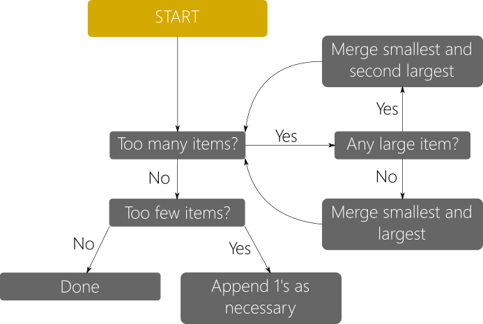

# Factor.py

## Basic Outline

The purpose of this program is to determine the dimensions of a given volume.
This sounds quite simple at first, the caveat is that the value of each axis
dimension needs to be as close to an even distribution as possible. This
essentially means that when we visualise it as a three dimensional shape. We're
doing our best to find the vectors that most closely make a cube.

At first glance this would seem to be quite simple as the cube root of any given
number would provide the optimal length of each edge. However, given the context
of process allocation, it quickly becomes more complicated; a fraction of a
process can not be allocated to a CPU. This introduces the final criterion of
this program: all the dimensions must be integers.

As I am not much of a mathematician, I took a more logical approach to the
problem. First, the tail factors of the original number are calculated and
collected in a list. This list is pre-sorted from least to greatest which will
be helpful in the next phase when we try to intelligently recombine items until
only 2-3 remain (Or however many are specified in the dimension parameter).

## Prime Factorization Method

```Python
def get_prime(self, number):
    if number in self.prime_list:
        self.factor_list.append(number)
        return  # Is prime; done.

    for value in range(2, int(number/2) + 1):
        if number % value != 0:
            continue  # Not clean division; try next.

        # else, value cleanly divides number
        # append prime factor, repeat with remainder
        self.factor_list.append(value)
        self.get_prime(int(number/value))
        break
```

The product of the list of factors is then compared to the initial volume.  This
catches any large prime numbers not found on the existing list of primes needed
to reach the correct value. Once the list is validated, it's time for it to be
recombined until the desired number dimensions is reached (In our example so far
we've been using three dimensions).

## Factor Recombination Method

In an attempt to imitate the logic of an actual person recombining the
condensing the list of prime factors, I arrived at the following pseudocode
implementation. In which the smallest and largest items in the list are combined
until an overflow point is reached. This overflow point is the actual cube root
of the initial number.

> NOTE:
> In examples where the number of desired dimensions is more or less than three,
> the algorithm will adapt to fill the specification; setting the overflow to be
> the nth root. The same holds true for any other areas dependent on the number
> of dimensions.

Once the overflow is reached, the smallest and second largest numbers are
combined. This is done until there are only four elements in the list
remaining. At which point the two smallest entries are combined and the
final distribution is achieved and sorted. Should the list of prime factors
be shorter than the desired number of dimensions, 1's are appended to the list
until it is long enough. And lastly, if the list of factors is already the
desired length, no action is performed before it is sorted.

```Python
def condense_list(self):
    while length > self.dimensions:
        if length == (self.dimensions + 1):
            # Case 1: List is 1 item too long
            # Combine the first 2 items
            # Done

        # Check for large values

        if contains_large:
            # Case 2: List contains a large value
            # Combine first and second largest
            length -= 1

        else:
            # Case 3: List is mostly even distribution
            # Combine first and last items
            length -= 1

    # End of while
    # Factor list is <= desired dimension
    if length < self.dimensions:
        # Extend to dimension length

    # Done
```

## Flowchart Representation:
<br/>

<br/><br/>


## Experiments

In the local directory experiments, there is a test script for the factorize
function. With it, any number can be factorized to three or a user-specified
value. For instance if you wanted to factorize 500 four ways, that is achieved
with and results in:

```Shell
$ python3 test.py 500 --dim 4
[5, 5, 5, 4]
```
